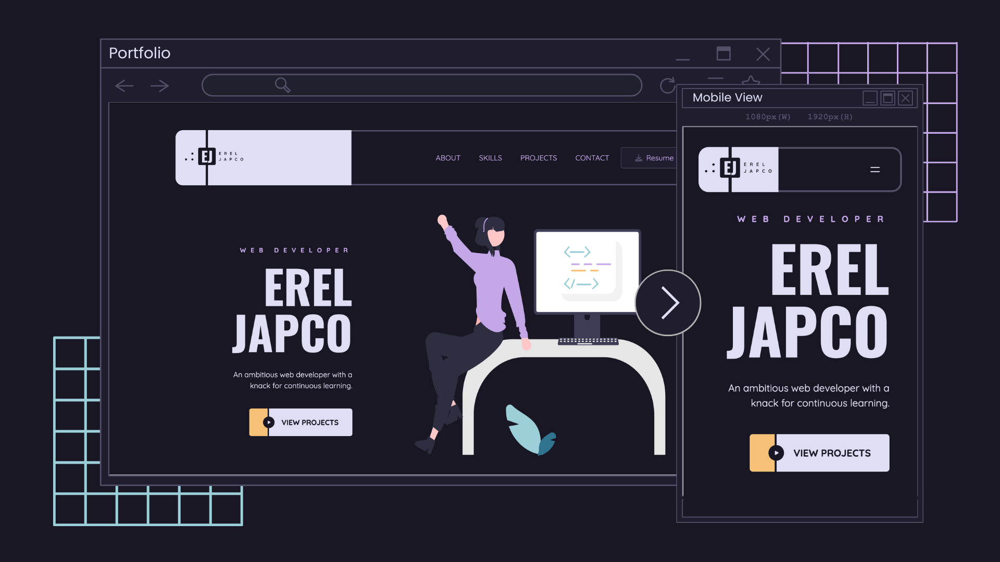

# Portfolio

Finally! A portfolio 🎉

Thanks to [BPI Foundation](https://www.bpifoundation.org/) and [Bayan Academy](https://www.bayanacademy.org/), I was able to build this portfolio website using HTML, CSS, and Javascript.

## Table of Contents

- [Portfolio](#portfolio)
  - [Table of Contents](#table-of-contents)
  - [Overview](#overview)
    - [Requirements](#requirements)
      - [Exercise 1](#exercise-1)
      - [Exercise 2](#exercise-2)
      - [Exercise 3](#exercise-3)
    - [Screenshot](#screenshot)
    - [Links](#links)
  - [My Process](#my-process)
    - [Built with](#built-with)
    - [What I learned](#what-i-learned)
    - [Continued Development](#continued-development)
    - [Useful Resources](#useful-resources)
  - [Author](#author)

## Overview

### Requirements

#### Exercise 1

Create a sitemap, wireframe, and prototype for a one-page website using Figma.

#### Exercise 2

Create the HTML structure of the prototype.

#### Exercise 3

Use CSS and Javascript to add styling and responsiveness to the one-page website.

### Screenshot

### Links

- Sitemap: [https://www.figma.com/design/TYjxpP90kgWfr9vPZB7M4w/Portfolio_Sitemap](https://www.figma.com/design/TYjxpP90kgWfr9vPZB7M4w/Portfolio_Sitemap)
- Wireframe: [https://www.figma.com/design/xBJLMUXeQ9LW7zGq64vhuf/Portfolio_Wireframe](https://www.figma.com/design/xBJLMUXeQ9LW7zGq64vhuf/Portfolio_Wireframe)
- Prototype: [https://www.figma.com/design/t4b6pkLMd3BUCiPdQrGR8q/Portfolio_Prototype](https://www.figma.com/design/t4b6pkLMd3BUCiPdQrGR8q/Portfolio_Prototype)
- Live Site URL: [https://ereljapco.github.io/portfolio/](https://ereljapco.github.io/portfolio/)
- Solution URL: [https://github.com/ereljapco/portfolio](https://github.com/ereljapco/portfolio)

## My Process

### Built with

- Semantic HTML5 markup
- CSS custom properties
- Desktop-first workflow
- Flexbox
- CSS Grid

### What I learned

- Plan before you code
  - I wish I knew this sooner. Being able to create a sitemap, wireframe, and prototype made it easier to code the website.
- Mobile-first workflow is easier
  - The prototype that we created was for desktop view. And, boy, it made it harder for me to add the responsiveness for smaller devices. But maybe because I was used to a mobile-first workflow.

### Continued Development

- Use the Github API to display the featured projects/repo.
- Add a projects page to display all the projects

### Useful Resources

- [Portfolio design by Creative Mints](https://dribbble.com/shots/20300654-Portfolio-design) - For the design inspiration
- [Rose Pine](https://rosepinetheme.com/) - For the beautiful color palette

## Author

- Portfolio - [https://ereljapco.github.io/portfolio/](https://ereljapco.github.io/portfolio/)
- LinkedIn - [www.linkedin.com/in/ereljapco](www.linkedin.com/in/ereljapco)
- FrontendMentor - [https://www.frontendmentor.io/profile/ereljapco](https://www.frontendmentor.io/profile/ereljapco)
